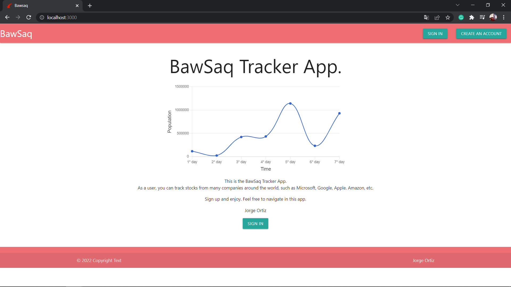
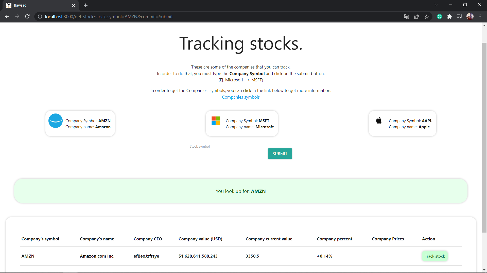
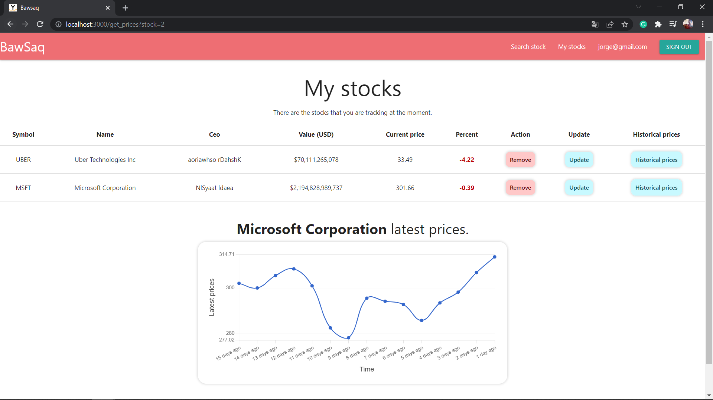

# Bawsaq Stocks App.

Bawsaq Stocks App was developed using Ruby and Ruby on Rails 7.

## App.

Heroku link: https://yorch-bawsaq.herokuapp.com

## Description

Bawsaq Stocks App was built in order to track stocks from many
companies around the world.

Working with IEX Cloud API, you can get a lot of information from 
different companies, such as GOOGLE, APPLE, MICROSOFT, AMAZON, etc.

You must sign up using your google account in order to use this app.

Once you logged in, you can start tracking stocks by typping the 
company's symbol. If you don't know where to get the companies' symbols,
you can visit this link: https://iextrading.com/trading/eligible-symbols

You can add, update and destroy stocks from your personal list. 
Besides, you can view the latest prices from an specific company.
This prices will be displayed in a graph.

I hope you enjoy this app.

## API Service

* IEX Cloud.

In order to get more information about this API, you can visit the link below
and know more about it.

link: https://github.com/dblock/iex-ruby-client

## Softwares and frameworks.

* Ruby: 3.0.1
* Ruby on Rails: 7.0.2
* IEX cloud.
* MaterializeCss
* PostgreSQL.
* VSCode.
* Windows 10.

## Author:

* Jorge Ortiz Mata.
* San Luis Potosí S.L.P. México
* ortiz.mata.jorge@gmail.com
* +52 (444) 576 3034.

## Images.

-----

-----

